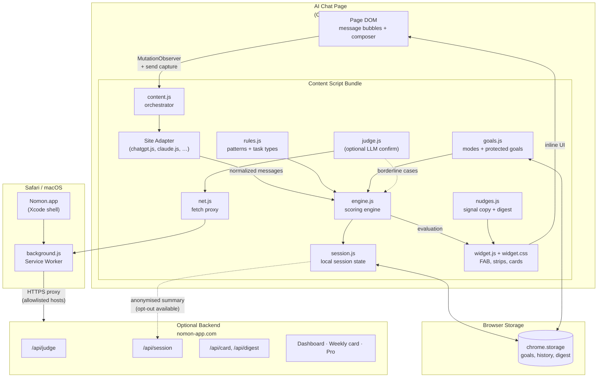
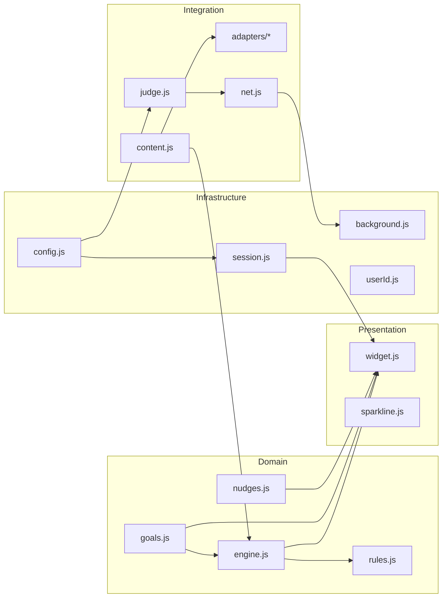
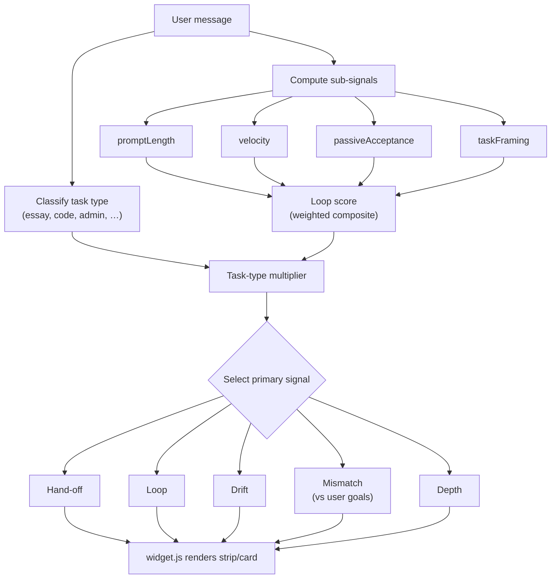

# Nomon Browser Extension — Technical Overview

> **One line:** Nomon is a cognitive-fitness layer for the AI era — a privacy-first browser extension that notices *when you stop critically evaluating* AI output and reflects it back to you. A mirror, not a nanny.

**Version:** Extension `v3.6.13` · Companion app at [nomon-app.com](https://nomon-app.com)  
**Last updated:** July 2026

---

## Table of contents

1. [What Nomon is](#1-what-nomon-is)
2. [Supported platforms](#2-supported-platforms)
3. [The five signals](#3-the-five-signals)
4. [Visibility modes](#4-visibility-modes)
5. [How it works (runtime pipeline)](#5-how-it-works-runtime-pipeline)
6. [Architecture layers](#6-architecture-layers)
7. [Module reference](#7-module-reference)
8. [Scoring engine](#8-scoring-engine)
9. [Privacy model](#9-privacy-model)
10. [Companion web app](#10-companion-web-app)
11. [Safari packaging](#11-safari-packaging)
12. [Practical application](#12-practical-application)

---

## 1. What Nomon is

Nomon sits quietly beneath your AI chats and reads the **structure** of the conversation — prompt length, velocity, passivity, task framing — not to surveil you, but to surface gentle signals when evaluation drops off.

**Key properties:**

- Scoring runs **locally in the browser** by default; nothing leaves your device unless you opt in.
- It measures **how** you use AI, not **how much**.
- It is **not** a screen-time limiter, blocker, or plagiarism detector.
- **Philosophy:** *A mirror, not a nanny.* No red alerts, no nagging, no blocking (except optional Guard mode).

Nomon ships as:

1. **A browser extension (Manifest V3)** — Chrome and Safari builds share the same JavaScript core. All scoring happens locally.
2. **A companion web app** — marketing site, optional account/dashboard, Pro layer, and anonymous data backend.

The name comes from *gnomon* (the pointer on a sundial): an instrument that casts a shadow; the reader takes the reading themselves.

---

## 2. Supported platforms

The extension injects content scripts on **17+ AI chat platforms**:

| Platform | Hosts |
|---|---|
| OpenAI ChatGPT | `chatgpt.com`, `chat.openai.com` |
| Anthropic Claude | `claude.ai` |
| Google Gemini | `gemini.google.com` |
| xAI Grok | `grok.com`, `x.com/i/grok` |
| Microsoft Copilot | `copilot.microsoft.com`, `m365.cloud.microsoft`, `copilot.cloud.microsoft` |
| Perplexity | `perplexity.ai`, `www.perplexity.ai` |
| Meta AI | `meta.ai`, `www.meta.ai` |
| Mistral | `chat.mistral.ai` |
| DeepSeek | `chat.deepseek.com` |
| Qwen | `chat.qwen.ai` |
| Kimi | `kimi.com`, `www.kimi.com`, `kimi.moonshot.cn` |
| MiniMax | `agent.minimax.io`, `chat.minimax.io`, `chat.minimaxi.com` |
| HuggingChat | `huggingface.co/chat` |
| Doubao | `doubao.com`, `www.doubao.com` |

Each site has a **DOM adapter** that normalizes that platform's message bubbles into a common `{ role, text, id, timestamp }` format. Adapters fail soft — a broken selector shows nothing rather than breaking the host page.

---

## 3. The five signals

The product's core vocabulary. One signal per moment; each has its own name, colour, and voice.

| Signal | Colour | What it means | In-session behaviour |
|---|---|---|---|
| **Hand-off** | Light blue | Early full-task delegation on your first message(s) — "what do you already know?" | Strip only; an invitation, never a gate |
| **Loop** | Green | In-session passivity — accepting several answers in a row without editing or pushing back | Strip + contextual nudge; heavier overlay only in Active/Guard at sustained high intensity |
| **Drift** | Amber | Cross-session decline — fewer questions than last week, accepting more | Strip label only; full analysis lives in the weekly digest, never an alarm |
| **Mismatch** | Purple | A prompt that conflicts with a goal *you* set — Nomon quotes your past self back | Strip + card |
| **Depth** | Blue | A high-stakes question where the thinking is the point — an invitation to pause before the answer loads | Strip + additive card; **never blocks the AI response** |

Signals appear as **quiet one-line strips** under your messages (never banners). Over the week they roll into a single shareable **weekly card**.

---

## 4. Visibility modes

One dial, switchable any time:

| Mode | Behaviour |
|---|---|
| **Ghost** | No in-session signals — you only get the weekly digest |
| **Ambient** | Loop + Drift strips only |
| **Active** | All signals + Mismatch/Depth reflection cards *(default)* |
| **Guard** | Active + a brief hold before send when a prompt clearly conflicts with a protected goal you wrote — **always bypassable** |

The first three modes never block you. Guard is the only mode that can intervene before send, and only on goals you explicitly wrote.

---

## 5. How it works (runtime pipeline)

### High-level flow



### Step-by-step

1. **Bootstrap** — `content.js` loads on supported AI pages, picks the matching site adapter (e.g. `LumenAdapterChatGPT`), and mounts the floating **FAB pill**.

2. **Message capture** — A `MutationObserver` watches the chat DOM. Send timing is captured on Enter/click so velocity scoring uses real timestamps. Historical messages loaded on page open get `null` timestamps and skip timing signals.

3. **Normalize** — Each adapter's `buildMessageList()` turns site-specific DOM into a unified message list ordered by document position.

4. **Score locally** — `engine.js` evaluates each user message with a weighted composite:
   - **Prompt length** — very short prompts suggest less engagement
   - **Velocity** — rapid-fire messages suggest less reflection
   - **Passive acceptance** — short continuations like "continue", "thanks", "ok"
   - **Task framing** — regex tiers for delegation vs. engagement
   - **Task-type multipliers** — ~20 categories (e.g. `essay_writing: 1.0`, `scheduling: 0.1`, `debugging: 0.5`)

5. **Optional LLM judge** — For borderline cases, `judge.js` POSTs to `/api/judge` (prompt text only, capped at 2500 chars). The backend can confirm or downgrade signals. Fully toggleable; falls back to local rules when unavailable.

6. **Render UI** — `widget.js` injects coloured strips, reflection cards, Guard holds, onboarding, and the weekly digest popover.

7. **Persist locally** — `session.js` stores loop scores, signal counts, and digest moments in `chrome.storage`, merged safely across tabs.

8. **Optional egress** — On tab close, anonymised session **counts** (not message content) can POST to the backend when `shareAnonymisedData` is on (default on, revocable in settings).

---

## 6. Architecture layers



### Repository layout (extension)

```
safari/Nomon/Nomon Extension/Resources/   (Safari build)
├── manifest.json          — MV3 config; content scripts on all LLM hosts
├── content.js             — bootstrap/orchestrator: adapter selection, send-capture, render loop
├── engine.js              — scoring engine (loop score + five-signal evaluation)
├── rules.js               — regex pattern tiers, task-type classification, engagement markers
├── nudges.js              — signal copy, weekly digest builder, AI-profile builder
├── goals.js               — onboarding, protected goals, visibility modes
├── session.js             — per-day local session storage, drift history, digest log
├── judge.js / net.js      — optional LLM classification + background fetch proxy
├── config.js              — single source of truth for backend URL
├── background.js          — service worker (proxies fetches to avoid loopback/PNA blocks)
├── widget.js / widget.css — all UI (strips, cards, badge/pill, onboarding, popover)
├── sparkline.js           — badge-popover chart
└── adapters/              — per-site DOM adapters
    ├── base.js            — shared factory for no-role-attribute sites
    ├── chatgpt.js         — bespoke role-attribute adapter
    ├── claude.js, gemini.js, grok.js, copilot.js, perplexity.js, …
```

**Adapter pattern:** `chatgpt.js` is a bespoke adapter using role attributes; `base.js` is a shared factory for sites without role attributes (DOM-order message building). Thin config files wrap the factory for Claude, Gemini, Grok, Copilot, Perplexity, and others.

---

## 7. Module reference

| Module | Role |
|---|---|
| `content.js` | Orchestrator: adapter selection, DOM sync, processing loop, Guard pre-send interception |
| `adapters/` | Per-site DOM parsers; normalize messages from each AI platform's HTML |
| `engine.js` | Core scoring + five-signal evaluation; weighted composite with task-type modifiers |
| `rules.js` | Regex tiers (TIER0/1/2), engagement markers, task classification, judge gating |
| `goals.js` | User modes (Ghost/Ambient/Active/Guard), protected goals, onboarding state |
| `nudges.js` | Human-readable signal labels, weekly digest copy, AI profile text |
| `widget.js` | All UI: FAB pill, inline strips, reflection cards, Guard hold, coach-mark tour |
| `session.js` | Per-day session storage, drift history, cross-tab merge, digest log |
| `judge.js` | Optional remote LLM confirmation for ambiguous evaluations |
| `net.js` | Fetch wrapper that routes through background service worker |
| `background.js` | Service worker; proxies HTTPS fetches to allowlisted backend hosts |
| `config.js` | Backend URL default (`https://nomon-app.com`) |
| `userId.js` | Anonymous persistent user ID for card sharing |
| `sparkline.js` | Mini engagement chart in the FAB popover |

---

## 8. Scoring engine



### Weights (loop score composite)

| Factor | Weight |
|---|---|
| Prompt length | 0.20 |
| Velocity | 0.25 |
| Passive acceptance | 0.30 |
| Task framing | 0.25 |

### Task-type examples

| Task type | Score multiplier | Notes |
|---|---|---|
| `essay_writing` | 1.0 | High-stakes; full weight |
| `decision_making` | 1.1 | Elevated |
| `learning_concept` | 1.2 | Elevated |
| `code_generation` | 0.65 | Moderate |
| `debugging` | 0.50 | Lower — iterative by nature |
| `email_drafting` | 0.15 | Auto-exempt after 2 messages |
| `scheduling` | 0.10 | Auto-exempt after 1 message |

**Engagement score** shown on the FAB = `100 − passive` (higher is better).

### Passive continuation detection

Short replies like "continue", "go on", "thanks", "ok", or any message ≤3 words without a question mark are treated as passive acceptance.

---

## 9. Privacy model

| Data | Where it stays |
|---|---|
| Message text for scoring | In-browser only (read from DOM, never stored as content) |
| Session aggregates | `chrome.storage` locally |
| LLM judge calls | Optional; sends capped prompt snippet (≤2500 chars) to configured backend |
| Session sharing | Opt-out available; **counts only**, no message content |
| Weekly card | Derived shapes/personas (Explorer, Thinker, Maker, Delegator, Balanced), not raw transcripts |

**Non-negotiable design principles:**

- No red anywhere in the UI.
- Ghost mode (fully invisible) is always available.
- Mismatch signals only come from goals *the user* set.
- Depth never delays the AI response.
- Drift is never a banner or alarm — it lives in the weekly digest.
- The reflection box is never required.

---

## 10. Companion web app

The extension works fully standalone. The Next.js app at `nomon-app.com` adds:

| Feature | Route / API |
|---|---|
| Marketing landing | `/` |
| Weekly dashboard | `/dashboard` (Pro-gated) |
| Public shareable card | `/card/[userId]` |
| Community shapes feed | `/community` |
| Calibration study | `/calibration` |
| Signup (age-gated 13+) | `/signup` |
| Session ingest | `POST /api/session` |
| LLM judge cascade | `POST /api/judge` |
| Weekly digest cron | `/api/digest` |
| Pro checkout | `/upgrade` (Polar webhook) |

**LLM judge cascade** (`web/lib/judge.ts`): tries OpenAI → Gemini → xAI, falling back to a local regex heuristic. Rate-limited per-IP with a global daily budget cap.

**Database** (Supabase/Postgres): aggregate-only, privacy-first tables — `users`, `sessions` (counts only), `weekly_summaries`, `signal_feedback`, `survey_responses`. No message content stored.

---

## 11. Safari packaging

The Safari build wraps the same JavaScript extension in an Xcode project:

```
safari/Nomon/
├── Nomon.xcodeproj/              — Xcode project
├── Nomon/                        — macOS host app (enables extension in Safari)
│   ├── AppDelegate.swift
│   └── ViewController.swift
└── Nomon Extension/
    ├── SafariWebExtensionHandler.swift   — native message bridge (stub)
    └── Resources/                        — all JS/CSS (identical to Chrome MV3)
        ├── manifest.json
        ├── content.js, engine.js, …
        └── adapters/
```

The extension logic is **platform-agnostic JavaScript**. Safari is a distribution channel, not a separate codebase. Build and package via `scripts/package-safari.sh`.

### Internal naming note

The product is branded **Nomon**, but much of the code still uses the legacy `Lumen*` namespace (`LumenEngine`, `LumenWidget`, `LumenSession`, etc.) from the earlier name. Functionally they are the same product.

---

## 12. Practical application

### Who it's for

Anyone who uses AI heavily and wants to stay conscious of *how* they're using it — researchers, writers, students, developers — without being blocked or judged.

### Typical session

1. You chat on Claude or ChatGPT as normal.
2. Nomon's FAB pill shows your engagement score in the corner.
3. If you send three passive "continue" messages in a row, a green **Loop** strip appears under your message: *"loop · still reading?"*
4. If you ask "write my entire essay on climate change" as your first message, a blue **Hand-off** strip invites you to draft something first.
5. If you set "Make my own decisions" as a protected goal and then ask "should I take this job?", a purple **Mismatch** card quotes your goal back.
6. At week's end, a digest summarizes your "shape" and trends into a shareable card.

### What it is not

- Not a usage blocker or screen-time limiter
- Not a plagiarism or AI-detection tool
- Not a productivity nag — uninstall risk is explicitly named as the biggest threat in product strategy
- Not a content logger — message text is never stored or transmitted by default

---

## Further reading (in repo)

| Document | Contents |
|---|---|
| `OVERVIEW.md` | Full product overview, GTM, monetisation context |
| `Nomon/NOMON-README.md` | Brand package, naming conventions, visual identity |
| `lumen_v2_spec.md` | Detailed signal taxonomy and scoring spec |
| `PLANNING.md` | Roadmap and open decisions |

---

*Nomon — from the gnomon. The instrument that casts a shadow; you take the reading yourself.*
